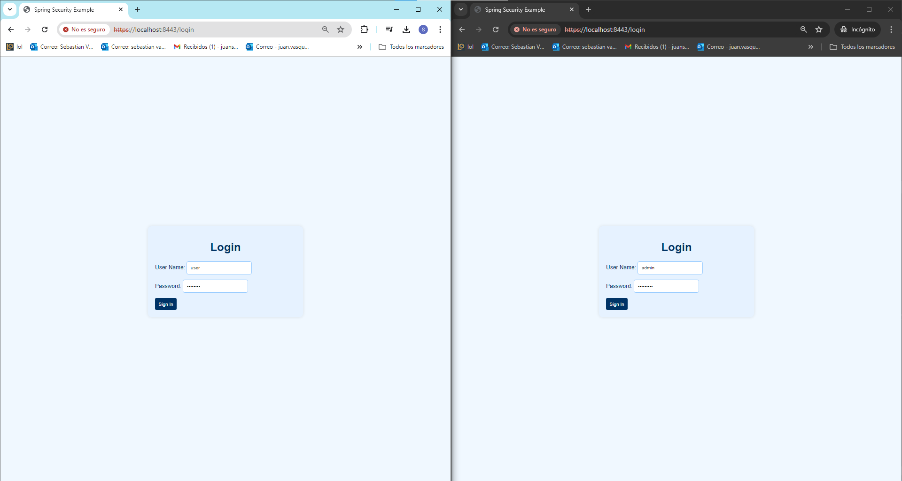
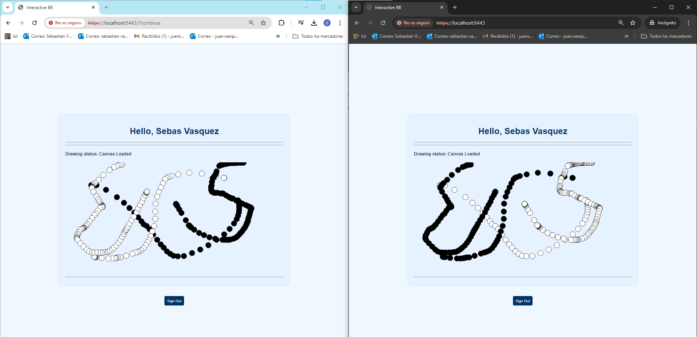
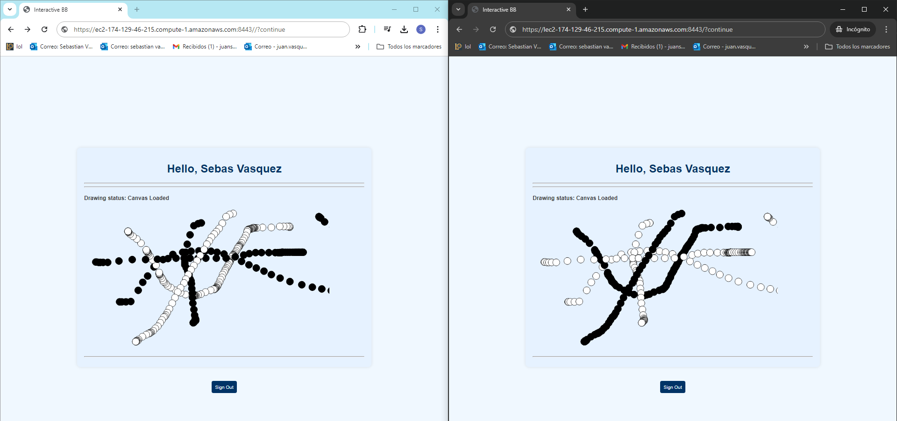
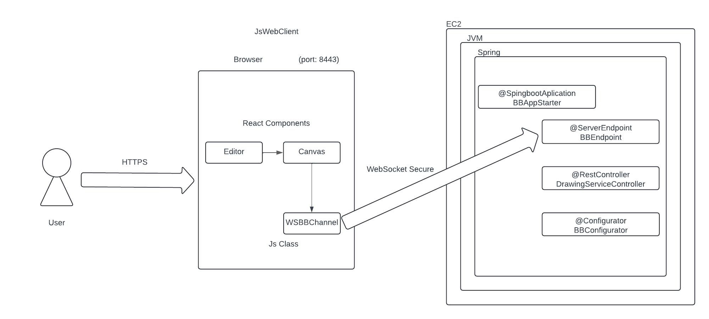

# MultiUserBoardWebSockets Secure

The project is a multiuser drawing board made up of two applications: one serves as the frontend and the other as the backend (API) built with Spring Boot. The backend now uses WebSockets to handle real-time communication between clients and the server. The frontend, developed in React JS, displays a board where users can draw circles by clicking. Being multiplayer, it can run in multiple browsers at once, enabling users to see changes in real-time.

### Features
+ **Draw**: You can draw consecutive circles using the mouse click.
+ **Secure Login**: User authentication with secure login.
+ **HTTPS and WSS**: Secure communication using HTTPS and WebSocket Secure (WSS).

## Getting Started
Download the project from 
[the repository.](https://github.com/Sebasvasquezz/MultiUserBoardWebSockets-Secure)

You can also clone the file using the following command.

```
git clone https://github.com/Sebasvasquezz/MultiUserBoardWebSockets-Secure 
```

### Prerequisites

* [Maven](https://maven.apache.org/): Automate and standardize the life flow of software construction

* [Git](https://www.git-scm.com/): Decentralized Configuration Manager

### Installing
1. Maven
    * Download Maven in http://maven.apache.org/download.html
    * You need to have Java installed (7 or 8)
    * Follow the instructions in http://maven.apache.org/download.html#Installation

2. Git
    * Download git in https://git-scm.com/download/win
    * Follow the instructions in https://git-scm.com/book/en/v2/Getting-Started-Installing-Git

### Installing

Once you have the cloned project in your repository. Follow the steps below to launch the program successfully.

#### Run Spring-boot

1. Open a terminal and enter the folder where you cloned the repository and enter the BoardSpring folder.

2. Use the following command to remove files generated in previous builds, compile the code, and package the project into a JAR or WAR file ready for distribution.
    ```
    mvn clean package
    ```
3. Now you can run the project using the following command.

    ```
    mvn spring-boot:run
    ```

4. Now open a browser and go to the following [link](https://localhost:8443/) to login:


5. After logging in you access the board to start drawing


5. You can also open a browser and go to the following [link](https://ec2-174-129-46-215.compute-1.amazonaws.com:8443/) to access the project on AWS:


## Project Structure

### BackEnd Spring-boot

- BBConfigurator: Configures the WebSocket server endpoint.
- BBEndpoint: WebSocket endpoint for handling mouse click data and broadcasting it to all connected clients.
- DrawingServiceController: REST controller for handling the status endpoint.
- WebSecurityConfig: Configures Spring Security for user authentication and secure login.

### FrontEnd React Js

#### Editor:

- Contains the main layout of the application including the BBCanvas component.

#### BBCanvas:

- Uses useRef to create references to the WebSocket connection and the p5 instance.
- Defines a sketch to configure and draw on the canvas.
- useEffect initializes the p5 instance and establishes the WebSocket connection when the component mounts.
- Handles incoming WebSocket messages to draw points on the canvas.
- drawPoint draws a circle on the canvas based on received coordinates.

#### WSBBChannel:

- Handles WebSocket connection logic, including opening the connection, receiving messages, handling errors, and sending messages.

#### BBServiceURL:

- Returns the WebSocket URL for the current host.

## Architectural Design



### Data Flow

#### Initialization:

- Editor mounts BBCanvas.
- BBCanvas initializes the p5 instance and establishes the WebSocket connection when the component mounts.

#### Drawing:

- When the user clicks on the canvas, BBCanvas creates a drawing action and sends it to the server via WebSocket.
- The WebSocket server (BBEndpoint) broadcasts the action to all connected clients.
- BBCanvas immediately draws the action locally on the canvas.

#### Update:

- When BBCanvas receives a drawing action from the WebSocket server, it parses the action and draws the corresponding point on the canvas.
- This ensures that all connected clients see the drawing actions in real-time.

## Built with

* [Maven](https://maven.apache.org/) - Dependency management

## Authors

* **Juan Sebastian Vasquez Vega**  - [Sebasvasquezz](https://github.com/Sebasvasquezz)

## Date

July 12, 2024

## License

This project is licensed under the GNU License - see the [LICENSE.txt](LICENSE.txt) file for details.
